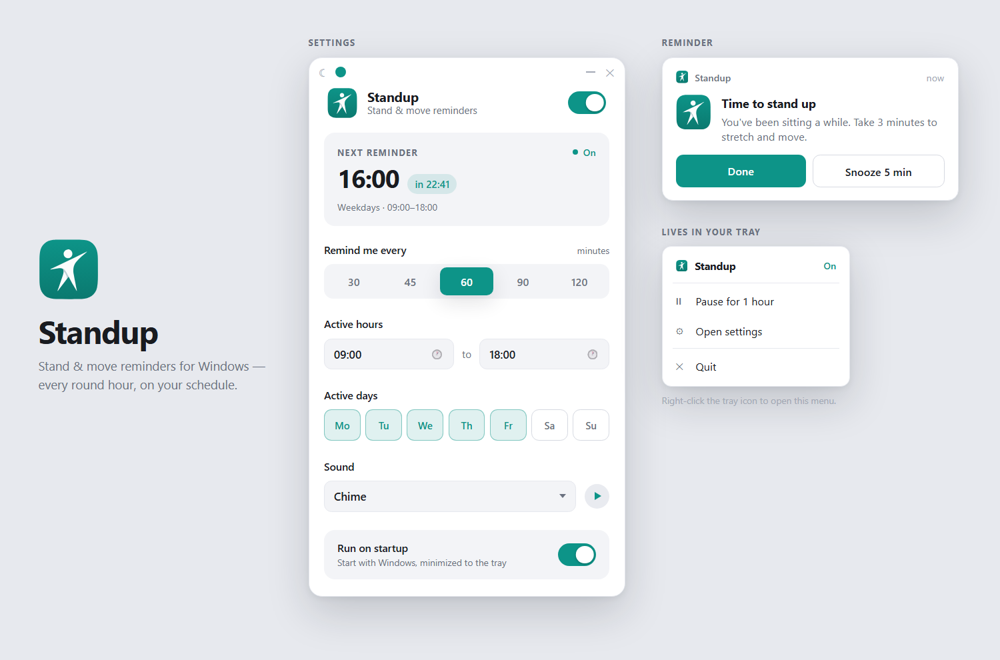

# Standup

Stand & move reminders for Windows - every round hour, on your schedule.



Standup is a small system-tray app that reminds you to get up and move when you've
been sitting at your desk. A quiet toast slides into the corner with a pleasant
chime - no account, no telemetry, no clutter.

> Built by [Dor Hay](https://github.com/dorhay87) using AI-assisted development -
> interactive design mockup first, then the real app to match.

## Features

- **Round-interval reminders** - every 30 / 45 / 60 / 90 / 120 minutes, aligned to
  the clock (a 60-minute interval fires on the round hour)
- **Your schedule** - active hours (default 09:00-18:00) and active days
  (default Mon-Fri); nothing fires outside them
- **Six built-in sounds** - Chime, Bell, Marimba, Soft Pop, Glass, Droplet - all
  synthesized live with the Web Audio API, previewable before you pick
- **Custom reminder toast** - bottom-right, never steals focus, with **Done** and
  **Snooze 5 min** actions; auto-dismisses after 2 minutes
- **Lives in the tray** - pause for 1 hour, open settings, or quit from the tray
  menu; closing the window just hides it
- **Personal** - light/dark theme (follows Windows until you choose) and five
  accent colors that recolor the whole UI, the logo, and even the tray icon
- **Run on startup** - optional, starts minimized to the tray
- **Tiny** - ~1 MB installer, ~3 MB installed. Built with Tauri on the WebView2
  runtime Windows already ships, not a bundled browser
- Survives laptop sleep sensibly: a reminder missed by up to 3 minutes fires on
  wake; older ones are skipped

## Install

Download the installer from the [latest release](../../releases/latest) and run it.
It installs per-user (no admin needed), adds a Start Menu entry, and can be
uninstalled from **Settings → Apps** like any program.

> The installer isn't code-signed, so Windows SmartScreen may warn on first run -
> click **More info → Run anyway**.

## Development

Prerequisites: Node.js and a Rust toolchain (`winget install Rustlang.Rustup`;
the MSVC build tools must be present).

```bash
npm install
npm start                 # run from source (first run compiles Rust - takes a few minutes)
npm start -- -- --debug-interval-min=1   # fire a reminder every minute (testing)
```

Settings are stored in `%APPDATA%\Standup\settings.json`.

### Scripts

| Script | What it does |
| --- | --- |
| `npm start` | Run the app from source (`tauri dev`) |
| `npm run dist` | Build the installer into `src-tauri/target/release/bundle/nsis/` |
| `npm run promo` | Re-render `promo.png` from `promo/promo.html` (headless Edge) |
| `npm run icons` | Generate placeholder icons (skips existing files) |

### Structure

```text
ui/             settings window, reminder toast, shared tokens & sounds (plain HTML/CSS/JS)
src-tauri/      Rust backend: scheduler, tray, window management, settings store, autostart
promo/          static promo card (source of promo.png)
tools/          icon generator, promo capture
```

The scheduler lives in the Rust backend: the next slot is computed from the
settings, and a once-per-second tick fires it, resyncs after sleep or clock
changes (a slot missed by more than 3 minutes is skipped, not replayed), and
keeps the tray and settings window in sync.
